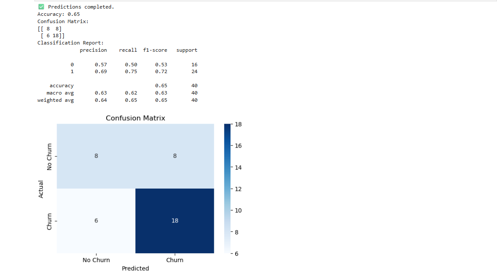
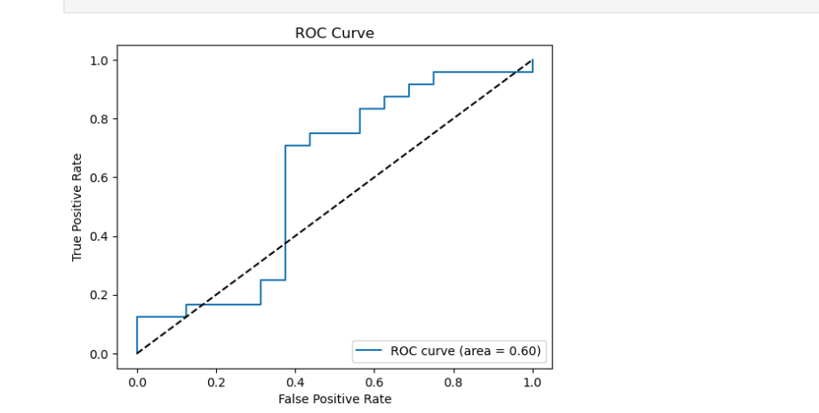
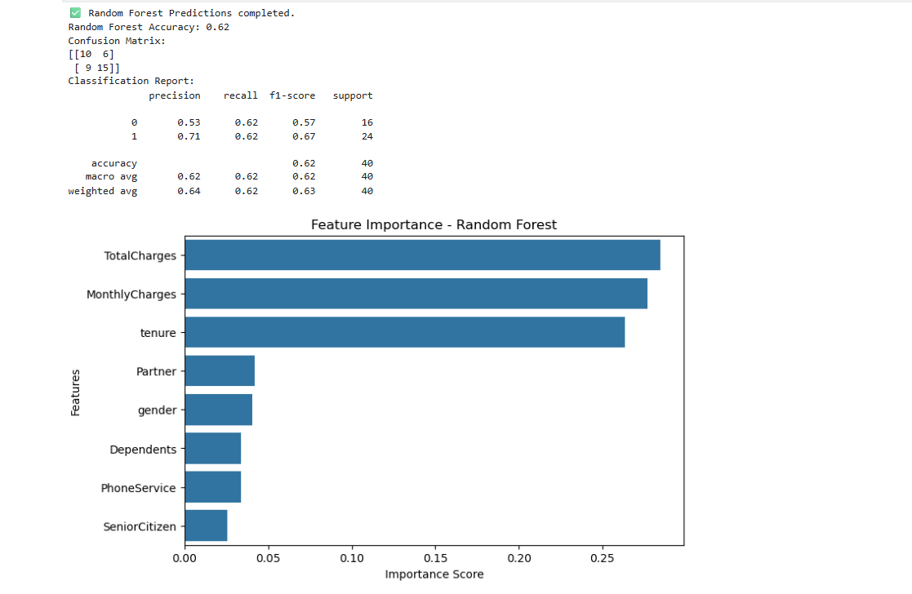
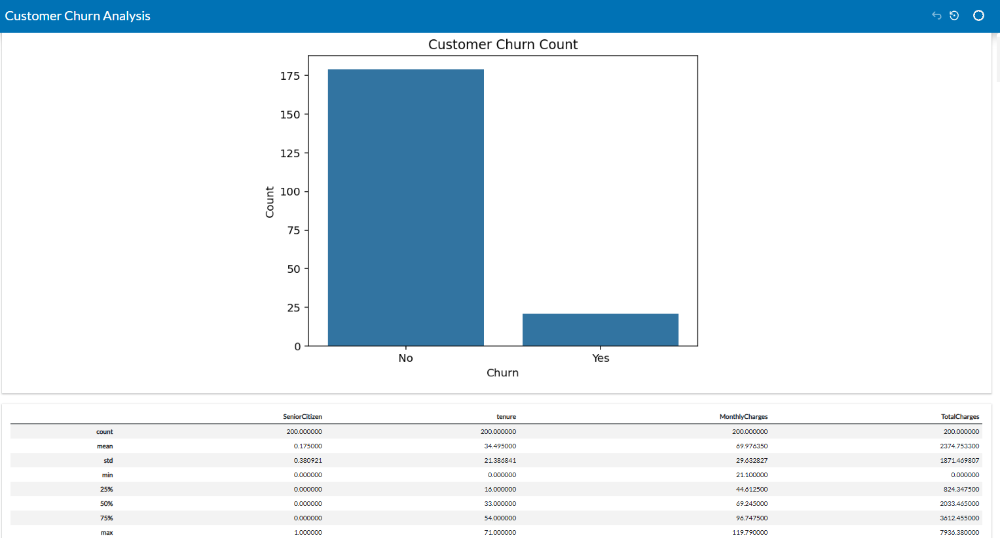
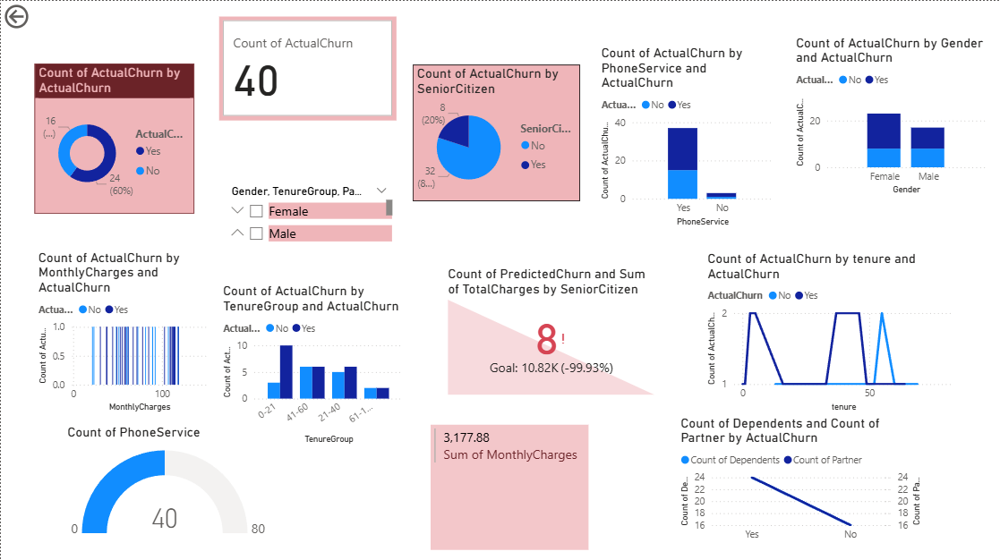

#  Telecom Customer Churn Prediction

This project uses **Machine Learning** and **Power BI** to predict telecom customer churn and visualize insights. It helps identify potential customers likely to discontinue service, allowing companies to take proactive retention steps.

---

##  Project Overview

- 🔍 Data: Synthetic customer churn dataset
- 🧠 ML Models: Logistic Regression, Decision Tree, Random Forest, XGBoost
- 📈 Visualization: Power BI interactive dashboard
- 🛠 Tools: Python, Jupyter Notebook, Pandas, Seaborn, Scikit-learn, Power BI

---

##  Dataset Description

- **Total Records**: 7,043 customers  
- **Target**: `Churn` (Yes/No)  
- **Features**:
  - Demographics (Gender, SeniorCitizen, etc.)
  - Services (Internet, Phone, Streaming)
  - Account Info (Tenure, Charges, Contract)

---

##  Machine Learning Process (Jupyter Notebook)

### ✔️ Steps:
1. Data Cleaning & Preprocessing
2. Label Encoding for categorical variables
3. Feature Selection & Train-Test Split
4. Model Training & Evaluation

###  Code Snippet:
```python
from sklearn.linear_model import LogisticRegression
model = LogisticRegression(max_iter=1000)
model.fit(X_train, y_train)
```

###  Model Accuracy:
- Accuracy: **~82%**
- Techniques used: Confusion Matrix, ROC AUC, Feature Importance

###  Confusion Matrix


###  ROC Curve


### Random Forest Feature Importance


###  Churn Analysis 



##  Power BI Dashboard Highlights

- Churn rate breakdown by:
  - Contract Type
  - Payment Method
  - Monthly Charges
- Demographic Insights
- Interactive filters for dynamic analysis

.


##  Installation Instructions

1. Clone the repo:
```bash
git clone https://github.com/yourusername/telecom-churn-prediction.git
```
2. Run Jupyter Notebook:
```bash
jupyter notebook Customer_Churn_Analysis.ipynb
```
3. Open `customer_churn_powerbi` in Power BI Desktop.

---

## 🤝 Let's Connect

If you find this useful, give it a ⭐ and connect with me for collaborations!
